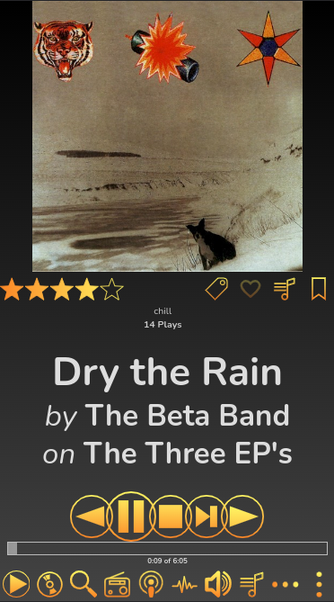
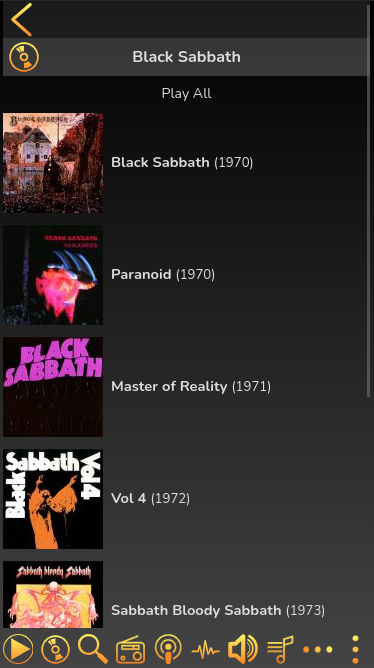
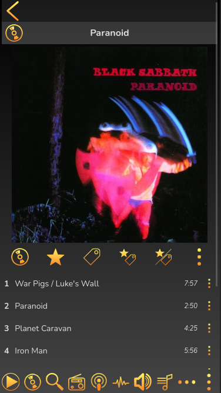
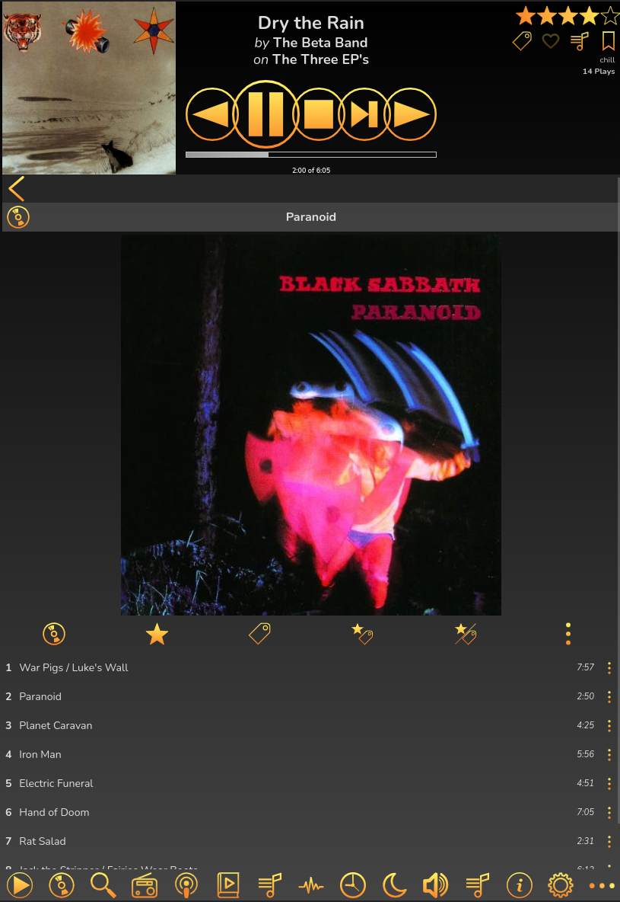
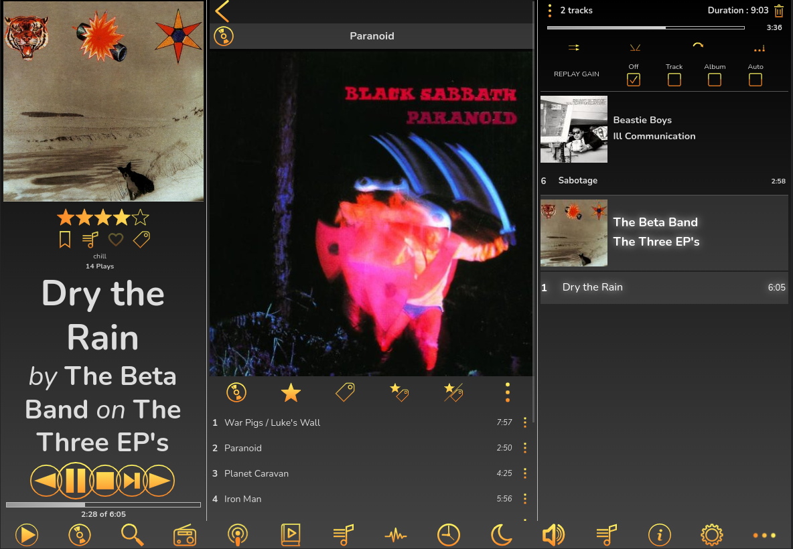

# The Phone Skin

The Phone Skin is the default if you're accessing RompЯ on touchscreen device.

It lays things out in a different way but is functionally identical to the Desktop skin except that drag-and-drop is not supported,
and nor is the Album Art manager. It also replaces the drop-down sections of the desktop skins with a more touch-oriented
interface.

The phone skin adjusts its layout according to the size and orientation of your screen.

For example here is how it looks on an iPhone SE showing the Now Playing screen.

Across the bottom are the icons to select different Music Sources, Volume, the Play Queue and two dropdown menus -
one of more icons that don't fit across the width of the screen, and one of plugins like the Playlist Manager, etc.

The default action on the Phone skin is to single-click to add items to the Play Queue, though this can be changed from the Configuration menu.

Instead of using multiple drop-down panels, the phone skin cycles through various screens when you select items.
For example, here is a screen of albums from the Music Collection for one artist.

The arrow at the top is the 'back' button, which will take you back to the main Collection screen.

And here's an album being browsed

The Play Options icons do the following:

* Play the whole album. For albums from online sources that return Album URIs (this is Mopidy backend dependant) this will always play the entire album, no matter if only a selection of tracks from it are in the display.
* Play only tracks that are in the display. This button will not be visible for sources where it is not relevant (eg local files).
* Play only tracks with Ratings
* Play Only tracks with Tags
* Play only tracks that are Rated and Tagged
* Play only tracks that are Rated Or Tagged

On larger screens the layout will adjust:

