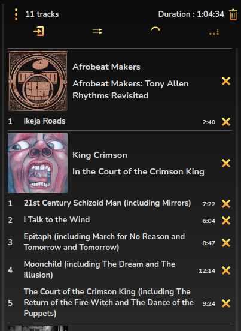
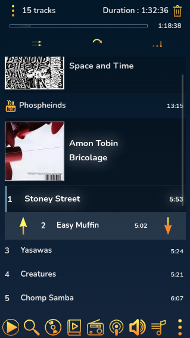

# The Play Queue

This panel appears on the right-hand-side of the window in the default Desktop skin.
It shows tracks that are currently playing and tracks queued to play next, in the order in which they will play.

To add a track or album (or all tracks by an artist) to the end of the Play Queue, double-click it in the collection
(single-click on the Phone skin).

On the Desktop skins you can also drag tracks to any position in the playlist.
You can re-order tracks or albums by dragging them within the playlist, and remove them by clickng the x.

On a touch device it works slightly differently. Firstly, to remove tracks or albums you swipe left.
To re-order tracks on a touch device use a long press on the track and and up/down arrows will appear.
Tap the arrows to move the track up and down the playlist.

To clear the entire playlist use the wastebasket icon at the top right.

Mopidy users can add tracks to the Play Queue from many other sources too - the [Discoverator](/RompR/Music-Discovery) panel
and the [Spotify Info](/RompR/The-Info-Panel) panel.

The 'Musical Notes' icon will appear next to Spotify albums. Clicking this will add the entire album to your collection.

## Interrupt, Shuffle, Repeat, Consume

Across the top of the play queue, in a dropdown that can be revealed and hidden using the "3 dots" icon are 4 controls

'Interrupt' will interrupt the current playback. Suppose you're listening to a long track (eg an audiobook or podcast) and you
want to listen to something else without losing your place. You can stop playback and use the 'Resume' function, but this is often
clunky especially if you use Consume mode. In these cases, engage "Interrupt" mode and then click (or double click) the thing you want to listen to.
The new item will be added to the top of the play queue and playback will start. You can add more tracks to the queue if you want. When
playback reaches the interrupted track it will automatically skip to the point where it was interrupted.

'Shuffle' will play the tracks from the Playlist in a random order (it does not re-order the Playlist).

'Repeat' will play the entire playlist on a loop, honoring Shuffle mode if it is enabled.

'Consume' will remove tracks from the Playlist as they are played. This is enabled by default when using dynamic playlists, to prevent your playlist becoming huge.

### MPD users

...also have an option to enable Crossfade (this is not supported in Mopidy) and use Replay Gain - but Replay Gain will only work if your tracks are tagged with Reply Gain information.
cha

## Non-Queueing Mode

Although the default option (and the way mpd works) is to add tracks to the Play Queue when you click them,
you can also enable a more 'Media Centre-like' mode. In the Configuration panel is an option for 'CD Player Mode'.
When this is enabled, when you double-click a track it will play immediately, removing any existing tracks from the Play Queue.
The album the track is from will be played from that track to the end.
In this mode you can add tracks to the end of the Play Queue by using the dropdown menu next to the tracks.

If CD-Player mode is not selected, the drop-down menu next to the tracks will have a 'Play From here' option, which will play the
album in the same way as if CD Player mode was enabled.